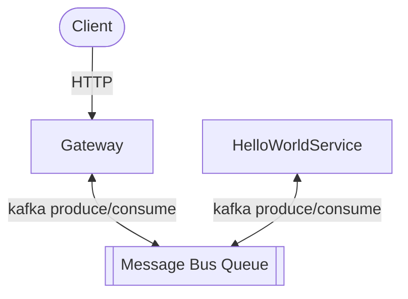
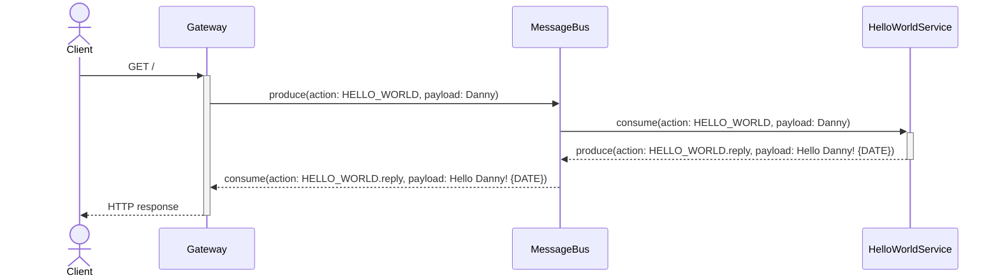

# Message Bus POC

The following demo is a Typescript implantation of Message Bus.

### flowchart


### sequence diagram


### Prerequisite

1. NodeJS (`nvm` recommended)
2. Docker (+docker compose) for running local Kafka
3. Kafka (for kafka cli commands)

### Setup

Install 
```bash
npm i
# or
npm ci
```

Start Kafka Server
```bash
docker compose -f docker-compose.yml up -d
```

Create topic
```bash
kafka-topics --bootstrap-server localhost:9093 --create --topic message-bus-microservices-poc-topic --partitions 8 --replication-factor 1
kafka-topics --bootstrap-server localhost:9093 --list
```

### Run Project

Run `helloWorldServer`
```bash
npm run start:helloWorldServer
```

Run http `gateway`
```bash
npm run start:gateway
```


### Kafka Topic Debug Commands

```bash
kafka-console-consumer \
    --bootstrap-server localhost:9093 \
    --property print.key=true \
    --property key.separator="-" \
    --topic message-bus-microservices-poc-topic \
    --group poc-group-app-cli-monit
```
